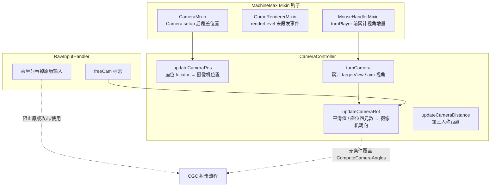
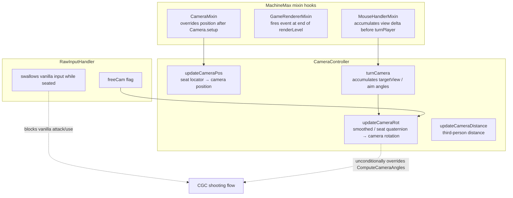

[English](#English)

# MachineMax 摄像机兼容总览

> 本文档说明 MachineMax 的摄像机体系如何影响 CGC 的枪械摄像机（后坐力、开镜 FOV、出弹位置），以及兼容模组在哪几个点做了矫正。MachineMax 自身有一套座位（`SeatSubsystem`）驱动的摄像机接管逻辑，但它的一部分摄像机覆盖在玩家**并未乘坐载具**时也会生效，这正是与 CGC 冲突的根源。

## 体系总图

MachineMax 的摄像机体系由三个 Mixin 钩子与一个 `CameraController` 事件订阅者组成：

## 摄像机主线

MachineMax 的摄像机控制落在两条主线上：

1. 摄像机**位置**：`CameraMixin` 在 `Camera.setup()` 末尾发 `ComputeCameraPosEvent`，`updateCameraPos` 只在玩家乘坐座位时把位置改成「座位 locator 世界坐标 + 旋转后的 firstPersonOffset」。
2. 摄像机**朝向**：`CameraController.updateCameraRot` 在 `ViewportEvent.ComputeCameraAngles` 里把 pitch / yaw / roll 覆盖为一份平滑值；乘坐座位且第一人称（或 followPose）时改为用座位姿态四元数反解欧拉角。

关键问题在于第 2 条：**`updateCameraRot` 的平滑覆盖在玩家没有乘坐座位时同样执行**。它用 `aimPitch/Yaw`（每帧从 `entity.getViewXRot/YRot` 采样）经 EMA + lerp 两级平滑后覆盖事件，导致摄像机滞后于玩家真实朝向。这就是 CGC 开镜回弹、后坐力被拖慢的直接原因。

各环节细节见子文档。

## 文档导航

|文档|内容|
|---|---|
|[MachineMax 摄像机体系](./machine-max-camera-system.md)|MachineMax 的摄像机位置 / 朝向接管与平滑逻辑|
|[兼容模组修改点](./cgc-compat.md)|兼容模组如何矫正被 MachineMax 干扰的 CGC 摄像机与出弹位置|

# English

> This document explains how MachineMax's camera system affects CGC's gun camera (recoil, scope FOV, bullet spawn position), and where the compat mod applies corrections. MachineMax has its own seat-driven (`SeatSubsystem`) camera takeover, but part of its camera override also runs when the player is **not** riding a vehicle — which is the root of the CGC conflict.

## Overview diagram

MachineMax's camera system consists of three mixin hooks and one `CameraController` event subscriber:

## Camera mainline

MachineMax's camera control runs along two lines:

1. Camera **position**: `CameraMixin` fires `ComputeCameraPosEvent` at the end of `Camera.setup()`; `updateCameraPos` changes the position to "seat locator world position + rotated firstPersonOffset" only while riding a seat.
2. Camera **rotation**: `CameraController.updateCameraRot` overrides pitch / yaw / roll with a smoothed value on `ViewportEvent.ComputeCameraAngles`; while seated in first person (or followPose) it instead derives Euler angles from the seat pose quaternion.

The key issue is line 2: **`updateCameraRot`'s smoothing override runs even when the player is not seated.** It samples `aimPitch/Yaw` (from `entity.getViewXRot/YRot` each frame) and, after EMA + lerp double smoothing, overrides the event, making the camera lag behind the player's true orientation. This is the direct cause of CGC's scope rebound and damped recoil.

See the sub-documents for details.

## Document navigation

|Document|Content|
|---|---|
|[MachineMax camera system](./machine-max-camera-system.md#English)|MachineMax's camera position / rotation takeover and smoothing logic|
|[Compat mod changes](./cgc-compat.md#English)|How the compat mod corrects CGC camera and bullet spawn position interfered by MachineMax|
