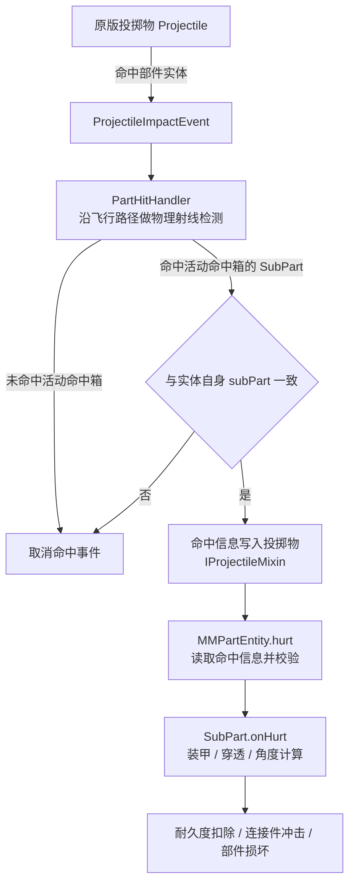

# MachineMax 出伤兼容总览

> 本文档说明 CGC 枪射物如何对 MachineMax 的部件实体（`MMPartEntity`）出伤。MachineMax 自身有一套基于物理射线检测的投掷物出伤流程，CGC 枪射物不走这套流程的原生入口，兼容模组把这套命中判定带进了 CGC 的判定流程。

## 体系总图

MachineMax 原本的投掷物射线检测与出伤流程：

## 出伤主线

MachineMax 的投掷物出伤主线固定为四个阶段：

1. 命中检测：投掷物命中部件实体，`PartHitHandler` 沿飞行路径做物理射线检测，确定真正被命中的子部件与命中箱，并把命中信息写入投掷物。
2. 出伤路由：`MMPartEntity.hurt` 读取命中信息并校验，路由到对应子部件。
3. 装甲穿透：子部件按装甲 / 穿透 / 角度模型计算实际耐久度损失。

CGC 枪射物绕过第 1、2 阶段的原生入口，兼容模组在 CGC 判定命中后复刻命中检测与出伤。各环节细节见子文档。

## 文档导航

|文档|内容|
|---|---|
|[MachineMax 投掷物出伤流程](./machine-max-damage-flow.md)|MachineMax 原本的投掷物射线检测与出伤流程|
|[兼容模组修改点](./cgc-compat.md)|兼容模组如何把 CGC 枪射物带入这套流程|
