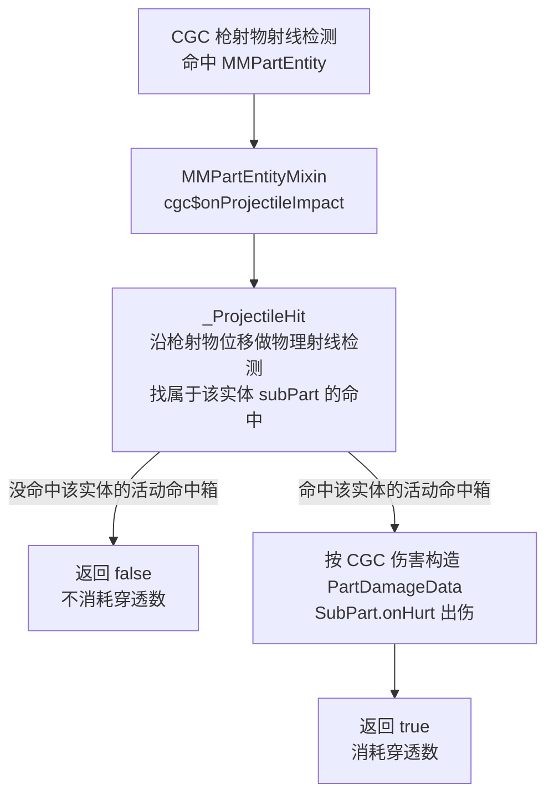

# 兼容模组修改点

> 兼容模组如何在 CGC 的枪射物判定流程里插入 MachineMax 的命中判定，以及这些修改对 MachineMax 原本流程的影响。

## CGC 判定流程与 MachineMax 的差异

CGC 的枪射物（`GunProjectile`，继承原版 `Projectile`）用自己的射线检测判断命中，命中后通过 `IBulletVictimEntity.cgc$onProjectileImpact` 手动出伤，不触发 NeoForge 的 `ProjectileImpactEvent`。

这带来两个差异：

- CGC 枪射物命中部件实体时，MachineMax 的 `PartHitHandler` 不会执行，命中信息不会写入投掷物。
- CGC 对受弹实体直接出伤，不会经过 MachineMax 的装甲 / 穿透模型。

## 修改点

兼容模组只改两个类，都位于 `dev.xcolorful.cgccompat.machinemax.core`：

|修改点|包路径|作用|
|---|---|---|
|`MMPartEntityMixin`|`mixin.entity`|让 `MMPartEntity` 实现 `IBulletVictimEntity`，接管 CGC 的命中回调|
|`_ProjectileHit`|`projectile.impact`|复刻 MachineMax 的物理射线判定，并把命中转成出伤|

`MMPartEntityMixin` 的 `cgc$onProjectileImpact` 只做转发，把 CGC 的命中结果交给 `_ProjectileHit`。

## 带入 CGC 判定流程后的行为

`_ProjectileHit` 以 CGC 的射线检测为准，再叠加 MachineMax 的命中箱判定：

1. 从 CGC 命中的实体取出 `subPart`。
2. 沿枪射物本 tick 位移对物理世界做射线检测。
3. 在命中结果里找属于当前实体 `subPart` 的活动命中箱（跳过车轮的滚动表面）。
4. 没找到时返回 `false`，表示不消耗穿透数、不打该部位。
5. 找到时按 CGC 的距离衰减伤害构造 `PartDamageData`，调用 `subPart.onHurt` 出伤，返回 `true`。

判定只针对当前实体的 `subPart`，不预测子弹随后是否命中其他实体。返回 `false` 时子弹继续飞行，由 CGC 的命中循环处理后续实体。

## 与 MachineMax 原本流程的对应

|MachineMax 原本|兼容模组|
|---|---|
|`PartHitHandler` 拦截事件做射线检测|`_ProjectileHit` 在 CGC 命中回调里做射线检测|
|命中信息写入 `IProjectileMixin`|命中信息直接用于构造 `PartDamageData`，不经过投掷物|
|`MMPartEntity.hurt` 读取命中信息出伤|`_ProjectileHit` 直接调用 `subPart.onHurt`|
|取消事件表示不命中|返回 `false` 表示不消耗穿透数|
